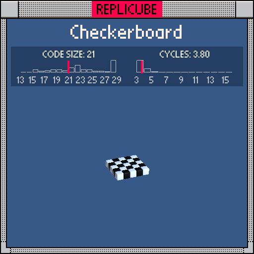
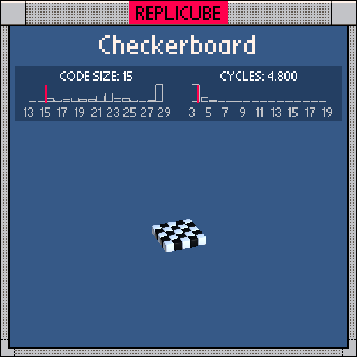

# checkerboard-0.lua

| Code size | Cycles / voxel |
| --------- | -------------- |
| 21        | 3.80           |

# checkerboard-1.lua

| Code size | Cycles / voxel |
| --------- | -------------- |
| 15        | 4.80           |

