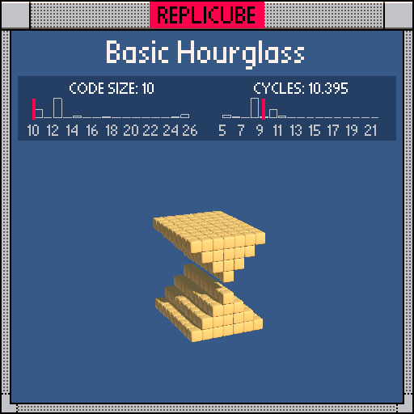

# basic-hourglass-0.lua

| Code size | Cycles / voxel |
| --------- | -------------- |
| 12        | 9.395          |

# basic-hourglass-1.lua

| Code size | Cycles / voxel |
| --------- | -------------- |
| 10        | 10.395         |

